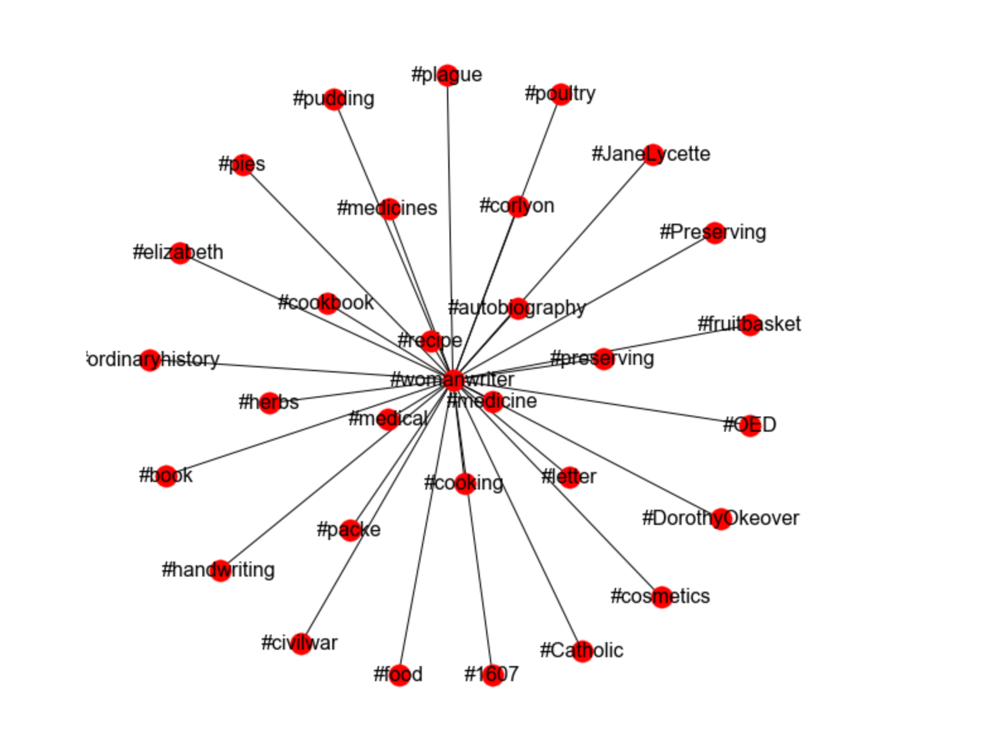

# Ideas for articles on "Participatory cultures" in Zooniverse forums

<!---
{#id .class width=200 height=200px}
--->

Dear all,

here are three abstracts that are nothing more than suggestions to what could
be researched using the forum data from the Zooniverse Talk pages, that came
up when Tom, Dick and I were talking afterwards. The approach
 is based on some preliminary work with the Shakespeare's world data, but
 the studies outlined below would benefit greatly from a comparative perspective
where data from different projects are investigated.

Overall, I think studies like these could bring about not only new research and
insights about how citizen science is practice. I think such articles could also
be valuable results to point to when discussing the benefits of CS approaches -
even regarding the ethics of volunteer contributions.

All three suggestions for studies approach online environments as "found data",
in the sense that the primary approach is anthropological (or "webnographical
as they say nowadays"). This way we would have the benefit of trying to
describe what is actually done, rather than relying on how volunteers
reconstruct their motivations and values when interrogated by a researcher
afterwards. Moreover, they also rely on a "quali-quantitative" method where
aggregate/statistical renderings help informing particular/qualitative analyses,
and vice versa. Code:

[https://github.com/christopherkullenberg/talk-analyzer](https://github.com/christopherkullenberg/talk-analyzer)

Please only read this as a quick writeup and summary of our discussions on the
zoominar on the 15th. If we decide to start working on these pieces, or decide
to pursue completely new scopes, I am sure all will surely change anyways.

/*Christopher*

\newpage

<!----------------------------------------------------------------------------->

## Study 1: Discovery in online environments
Discovery is essential to scientific progress. It is also one of the reasons
that the sciences and humanities attract large interest from the general
public and one of the reasons for why science is the preferred method of
obtaining new and useful knowledge in society.

By convention, scientific discoveries have been closely associated with
educated or professional scientists breaking new grounds by tediously, and with
the aid of expert knowledges, working his or her way towards unveiling the
unknown territories that have escaped human knowledge up until now.

However, as citizen science projects have begun inviting non-scientist into
the immediate work with source data and observations, discovery of new
phenomena have been extended to a much larger crowd of people, many of them
lacking formal training or education, but often being devoted to the subject
matter of what is being studied.

## Purpose and research questions
The purpose of this article is to understand how discoveries are made by
non-scientists in online forum environments. From the perspective of how
volunteer contributors discuss and analyse scientific data, the following
questions can be posed:

1. How are phenomena and data identified as novel discoveries?
2. What additional/contextual knowledge is required to define a discovery?
3. How are new discoveries understood in terms of attribution and recognition?

### Methodological approach
One approach is to compare only discoveries across projects. Three [or four or
five] case studies can be outlined and compared:

1. Discovering new words in Shakespeare's world. In this project, unknown words
from the past are the object of discoveries. As volunteer contributors are
transcribing texts, they also keep an eye out for words that do not exist in the
Oxford English Dictionary. However, deciding what is really a new word and not
only a variation in spelling, artefact or false positive must be decided in
conversation in the online forum.
2. Discovering.... Disc Detective
3. Naming and classifying chimpanzees. How are new individuals defined, named
and turned into specific points in the dataset? How are chimpanzee behaviours
discovered in the online forums, and what value are placed on the volunteer
contributor's theories and speculations about wildlife behaviour?
4. ...
5. ...

Comparative study between one case where discoveries are primarily made by
detecting pattern variations/anomalies, for example the galaxy-based images,
and a project where contextual or additional data is required, such as finding
a new word in Shakespeare's world. Here the central question would be to look
at potential differences between science and humanities projects, to try to
find out if there are different standards of what counts as a discovery in the
respective cases, and what epistemological issues are at stake for determining
whether a discovery has been made or not.

In both of these approaches we would utilise hashtags and search terms to find
where in the forum datasets discoveries are being made, discussed, valued
and disseminated.

\newpage

<!----------------------------------------------------------------------------->

## Study 2: Interpretative knowledges in online environments
Celebrated in the humanities, but also in the sciences, interpretation of
data is affected by increasing knowledges and previous experiences. This
process is also a key component in learning and understanding. In citizen
science projects, volunteers are interacting directly with raw data that has
been brought to the web by researchers. As non-scientists without formal
training begin to dynamically interact with the data, especially when doing so
continuously over time, a reasonable hypothesis would be that the
necessary auxiliary knowledges needed to understand the wider context
(historical, spatial, cultural) increase. Such a process would then qualify
as what interpretative and hermeneutically bent theorists would call
*Bildung*. But does it really happen in online environments, as non-scientists
engage with source data?

This article would test the "Bildung hypothesis" against concrete forum data.

### Method:
Follow/trace individual users from their first forum posts for a longer period
of time.

What to look for:

* Does contextual knowledge increase over time, and does it affect the
interpretation of data?
* Do individual observations shape a coherent/systematic whole, where
knowledge can be discussed?
* Does the interaction between researchers and volunteer advance understanding
of the research questions (as defined by both researchers and volunteers)?
* Does the terminology/concepts and level of discourse increase and become
more precise over time?
* How are additional resources used by non-scientists and in the interaction
with researchers.

Focus on the result of interpretation. Does knowledge grow.

\newpage

<!----------------------------------------------------------------------------->

## Study 3 - The values of citizen science
In the history of science, there
have been numerous attempts to define values that are held dearly by the
scientific community in order to preserve the autonomy of science and
protect the universal claims to knowledge. However, these values have almost
exclusively been discussed by academics and politicians during the 20th
century. With the citizen science turn throughout several academic disciplines,
these values of science are no longer the exclusive concern of professional
scientists. Rather, they

* What values do non-scientists defend in citizen science?
* What is the role of moderators in upholding values?

### Method
* Identify instances when values are challenged and norms are
broken to explore the arguments that attempt to defend the values.
* Follow the moderators to understand how values are upheld in a [pseudo]-
hierarchal fashion.

### Background
Two of the most influential accounts regarding scientific values and the ethos
of scientific inquiry were Robert K. Merton and Karl R. Popper. They both have
in common that they wanted to defend the autonomy and purity of science by
shielding its rationality from outside authority, such as church, state or
commercial interests. In their respective views, the problems of games and
competition in science unfold along quite different lines, and can both be a
threat to science as well as a way of motivating scientists to do better
research.

Merton argued that science, as a socially and historically shaped institution of
knowledge, was held together by the ”satisfaction of important values”
(1938:255). These values would, at least ideally, make possible a “pure science”
that was autonomous in relation to religious, political and commercial
interests. In the Mertonian vision of science, competition permeated the social
structure of science, and motivated scientists strive towards being the first to publish a novel finding or discovery. Competition was primarily productive in Merton’s view, as it was tamed by the values of communalism and universalism. In The Normative Structure of Science (1942) he argued that ”[t]he products of competition are communized, and esteem accrues to the producer ”(274), meaning that as discoveries were made public, they immediately became a common good simultaneously as the individual researches were given credit for their work. This way, the individual was forced to share with the community in order to receive personal recognition because ”[s]ecrecy is the antithesis of this norm [disinterestedness], full and open communication its enactment” (274). For Merton, something held in secrecy could never be scientific as it under such circumstances as the results could not become the object of organised scepticism. But this would only be valid when science is understood as a ready-made result. In Merton’s analysis the very process of research was not communal, in the sense that each step in the research process was made transparent and available to all. Only as scientific results were published, scientific knowledge could become a public good, available to anyone. In later accounts within science and technology studies, competition as a core driver of science was expanded upon even further. The most striking example is perhaps Bruno Latour’s Science in Action (1987) where research is described as a fierce competition between scientists struggling to align stronger and stronger networks of peers, instruments and institutions in order to win over their competitors.

Franzoni and Sauermann argue that citizen science, or “crowd science” as they call it, offers a radically more open science. While the “traditional science” referred to in the works of Merton were open in the sense that the end results of the scientific process were made public, the emerging forms of citizen science instead open up channels for participation in the very process of scientific research simultaneously as source data and results are made published openly, revealing the scientific process as a whole. However, according to Franzoni and Sauermann, the new forms of open citizen science run into a contradiction because traditional science is configured to make scientists to “build a competitive advantage over rivals” (p. 9) as they race to publish first. The competitive realities of traditional Mertonian science is thus challenged by new types of open science unveiling more or less the entire research process.  

The social perspectives on science stand in stark contrast to the Popperian view, which is most clearly expressed in The Logic of Scientific Discovery (XXXX). Here Popper elaborates on the “game of science”, which he conceives of as necessarily without an end or a final winner. In his theory of falsification, all hypotheses must be continuously challenged and there can be no “verified” truths that withstand scientific scrutinization. For Popper, however, it is not primarily an individual person who is the player of the game of science. Rather, as argued in Epistemology without a Knowing Subject (1972) it is “objective theories, objective problems and objective arguments” that compete with each other in a game that can only be lost according to the principle of falsification, not won. Consequently, the personal interests of scientists hardly matter as long as they adhere to the demarcation criteria of falsification. As long as their hypotheses can be refuted, science as a whole will progress, even if it means that individual scientists loose the game.

Another central difference between Popper and Merton resides in their respective notions of inclusion in the scientific process. For Popper, there ought not be any thresholds for participating in science as a critical endeavour, since individuals are merely the vehicles of hypothesis testing. For Merton, on the other hand, participation in the scientific culture would be inclusive according to the principle of universalism (1942), as this principle would ensure that scientific results would not be judged according to the scientist’s race, religion or cultural background. However, as Merton observes that competition between peers is a strong motivational driver, the end result still consists of stratified and meritocratic community.
